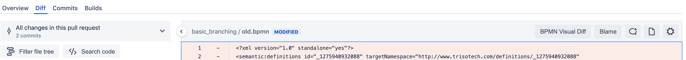
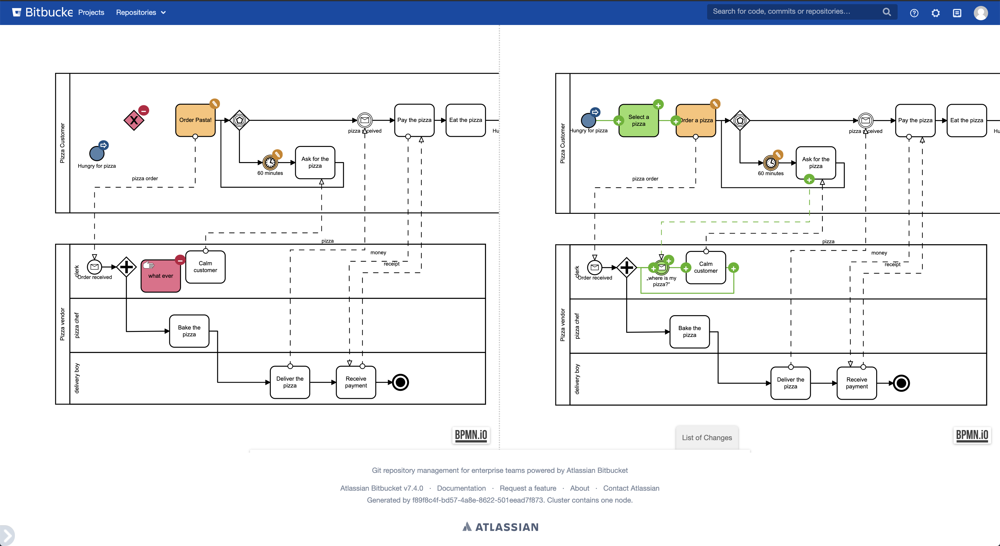

# BPMN Diff Bitbucket Plugin
This plugin allows to visually compare BPMN file versions during pull requests in Bitbucket Server. 

The plugin adds "BPMN Visual Diff" button to the Pull Request Diff page. 



The button is visible only for BPMN files and leads to a separate page which allows to visually compare two BPMN file 
versions. 



## Build Requirements
 - **Node** 12.13.0
 - **Maven** 3.6.2
 - **Java JDK** 1.8
 - [**Atlassian SDK 8**](https://developer.atlassian.com/server/framework/atlassian-sdk/downloads/)
 
## Usage Requirements
 - Bitbucket Server **7.0**
 - Client-side Extensions Runtime **1.2.3**

## Starting Bitbucket

To start Bitbucket, first install all the maven dependencies:

```sh
atlas-package -DskipTests
```

Next, run this command to start Bitbucket:

```sh
atlas-run -DskipTests
```

## Developing the plugin

In the project directory, you can run:

### `npm start`

It builds the frontend and puts it in the watch mode with hot reload.
In other words, if you have the whole plugin, and an instance already working,
this will enable you to make quick changes with an instant preview.

## Authors & Contributors
- [Yaroslav Rudykh](https://github.com/rudykh-yaroslav) (Author)

## Contributor Notice

We are always open for contributions. Feel free to submit an issue or a PR. However, when submitting a PR we will ask 
you to sign our [CLA (Contributor License Agreement)][cla-text] to confirm that you have the rights to submit your 
contributions and to give us the rights to actually use them.

When submitting a PR our special bot will ask you to review and to sign our [CLA][cla-text]. This will happen only once 
for all our GitHub repositories.

## License
Copyright Ⓒ 2020
["Sberbank Real Estate Center" Limited Liability Company](https://domclick.ru/).

[MIT License](./LICENSE.md)